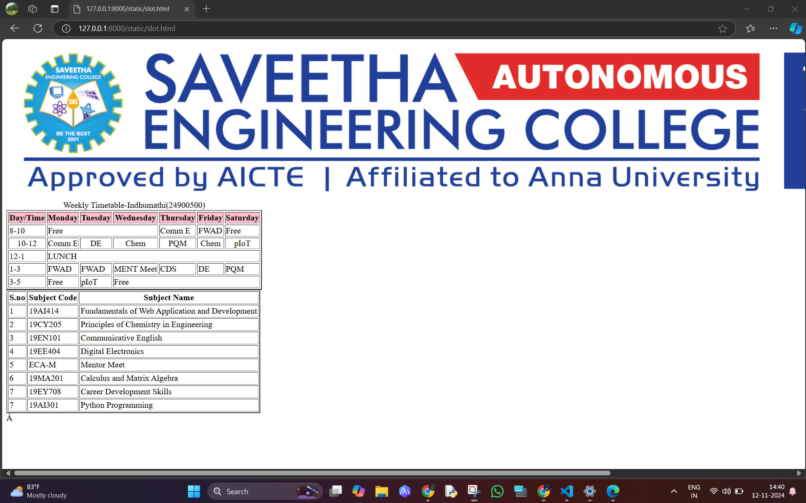

# Ex03 Time Table
## Date:
12/11/2024
## AIM
To write a html webpage page to display your slot timetable.

## ALGORITHM
### STEP 1
Create a Django-admin Interface.

### STEP 2
Create a static folder and inert HTML code.

### STEP 3
Create a simple table using ```<table>``` tag in html.

### STEP 4
Add header row using ```<th>``` tag.

### STEP 5
Add your timetable using ```<td>``` tag.

### STEP 6
Execute the program using runserver command.

## PROGRAM
```
<html>
    <body>
        
        <table border="2" cellspacing="3">
            <caption>Weekly Timetable-Indhumathi(24900500)</caption>
            <tr bgcolor="pink" align="center">
                <th>Day/Time</th>
                <th> Monday</th>
                <th>Tuesday</th>
                <th>Wednesday</th>
                <th>Thursday</th>
                <th>Friday</th>
                <th>Saturday</th>

            </tr>
            <tr align="centre"> 
                <td>8-10</td>
                <td colspan="3">Free</td>
                <td>Comm E</td>
                <td>FWAD</td>
                <td>Free</td>
            </tr>
            <tr align="center"> 
                <td>10-12</td>
                <td>Comm E</td>
                <td>DE</td>
                <td>Chem</td>
                <td>PQM</td>
                <td>Chem</td>
                <td>pIoT</td>
            </tr>
            <tr align="centre">
                <td>12-1</td>
                <td colspan="6">LUNCH</td>

            </tr>
            <tr align="centre"> 
                <td>1-3</td>
                <td>FWAD</td>
                <td>FWAD</td>
                <td>MENT Meet</td>
                <td>CDS</td>
                <td>DE</td>
                <td>PQM</td>
            </tr>
            <tr align="centre"> 
                <td>3-5</td>
                <td>Free</td>
                <td>pIoT</td>
                <td colspan="4">Free</td>

            </tr>
        </table>
        <table border="2" cellpadding="2">
            <tr> 
                <th>S.no</th>
                <th>Subject Code</th>
                <th>Subject Name</th>
            </tr>
            <tr> 
                <td>1</td>
                <td>19AI414</td>
                <td>Fundamentals of Web Application and Development</td>
            </tr>
            <tr>
                <td>2</td>
                 <td>19CY205</td>
                <td>Principles of Chemistry in Engineering</td>
            </tr>
            <tr> 
                <td>3</td>
                <td>19EN101</td>
                <td>Communicative English</td>
            </tr>
            <tr>
                <td>4</td>
                <td>19EE404</td>
                <td>Digital Electronics</td>
            </tr>
            <tr>
                <td>5</td>
                <td>ECA-M</td>
                <td>Mentor Meet</td>
            </tr>
            <tr> 
                <td>6</td>
                <td>19MA201</td>
                <td>Calculus and Matrix Algebra</td>
            </tr>
            <tr>
                <td>7</td>
                <td>19EY708</td>
                <td>Career Development Skills</td>
            </tr>
            <tr>
                <td>7</td>
                <td>19AI301</td>
                <td>Python Programming</td>
            </tr>
        </table>


        </table>
    </body>
</html>

```
## OUTPUT!



## RESULT
The program for creating slot timetable using basic HTML tags is executed successfully.
